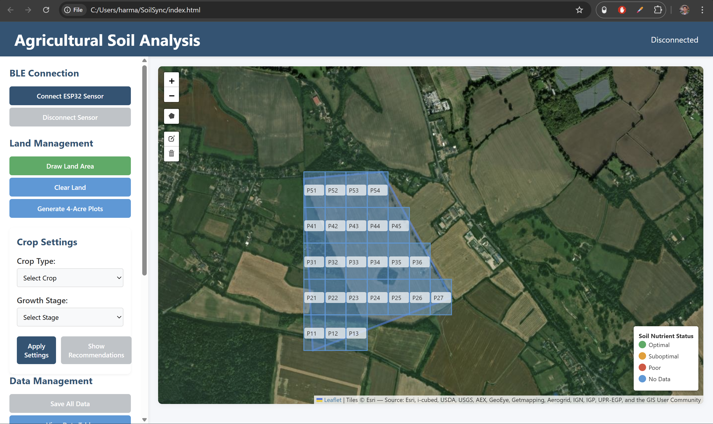

# SoilSync

An IoT soil monitoring system that helps farmers optimize fertilizer use through real-time NPK tracking.

## What it does
- Reads Nitrogen, Phosphorus, and Potassium levels from a soil sensor
- Transmits data wirelessly via Bluetooth Low Energy (BLE)
- Displays real-time readings on a web dashboard with heatmap visualization
- Provides crop-specific fertilizer recommendations based on sensor data

## Hardware

- ESP32 microcontroller
- NPK soil sensor (UART communication)
- Custom BLE server/client pipeline

## Recognition

- Gold Medallion — Senior Engineering Category, WWSEF 2025
- Built with input from 30+ local farmers in the KW region

## Stack
- Firmware: C++ (Arduino IDE)
- Dashboard: HTML, CSS, JavaScript, Web Bluetooth API, Leaflet.js